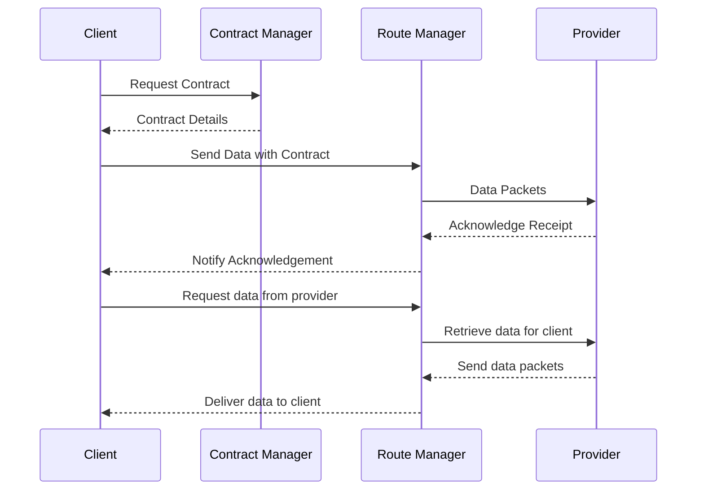
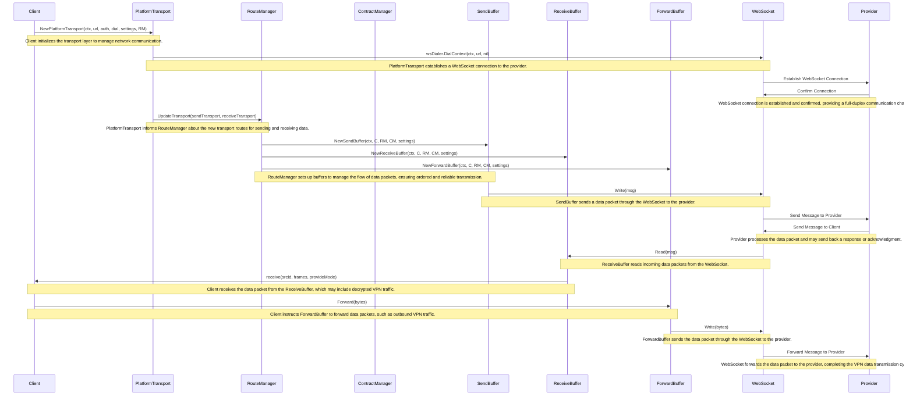

# BringYour Connect

A web-standards VPN marketplace with an emphasis on fast, secure internet everwhere. This project exists to create a trusted best-in-class technology for the "public VPN" market, that:

- Works on consumer devices from the normal app stores
- Allows consumer devices to tap into existing resources to enhance the public VPN. We believe a more ubiquitous and distributed VPN will be better for consumers.
- Emphasizes transparency, privacy, security, and performance

## Protocol

[Protocol defintion](protocol): Protobuf messages for the realtime transport protocol

[API definition](api): OpenAPI definition for the API for clients to interact with the marketplace

## Building

The Go codebase is cross-platform and meant to run on client and server. It can be packaged into mobile apps via gomobile, linked to native clients, and server code. Since it uses web-standards (HTTPS, WSS, WebRTC), it can also be compiled to WASM to embed in the web.

[Provider](provider) Is a container that implements the provider service. The default is to build and deploy with [Warp](https://github.com/bringyour/warp). See [provider/README.md](provider/README.md) for how to deploy a provider to follow the community distribution.

## Example Code

#### Create a provider

```Go
instanceId := connect.NewId()
apiUrl := "https://api.bringyour.com"
platformUrl := "https://connect.bringyour.com"

// `byJwt` is allocated from the `/auth/login*` API
// `clientId` is allocated with the `/network/auth-client` API


connectClient := connect.NewClientWithDefaults(ctx, clientId)

routeManager := connect.NewRouteManager(connectClient)
contractManager := connect.NewContractManagerWithDefaults(connectClient)
go connectClient.Run(routeManager, contractManager)

auth := &connect.ClientAuth{
    ByJwt: byJwt,
    InstanceId: instanceId,
    AppVersion: Version,
}
platformTransport := connect.NewPlatformTransportWithDefaults(cancelCtx, platformUrl, auth)
go platformTransport.Run(routeManager)

localUserNat := connect.NewLocalUserNatWithDefaults(cancelCtx)
remoteUserNatProvider := connect.NewRemoteUserNatProvider(connectClient, localUserNat)


// close
remoteUserNatProvider.Close()
localUserNat.Close()
connectClient.Cancel()
```

#### Create a client to a single destination

A client acts like a socket that can address multiple destinations. The clientId is tantamount to an `IPv6`. New clientIds are allocated with `/network/auth-client`.

The transfer speed of each client is limited by its slowest destination. All traffic is multiplexed to a single connection, and blocking the connection ultimately limits the rate of `SendWithTimeout`.

```Go
instanceId := connect.NewId()
apiUrl := "https://api.bringyour.com"
platformUrl := "https://connect.bringyour.com"

// `byJwt` is allocated from the `/auth/login*` API
// `clientId` is allocated with the `/network/auth-client` API


connectClient := connect.NewClientWithDefaults(ctx, clientId)

routeManager := connect.NewRouteManager(connectClient)
contractManager := connect.NewContractManagerWithDefaults(connectClient)
go connectClient.Run(routeManager, contractManager)

auth := &connect.ClientAuth{
    ByJwt: byJwt,
    InstanceId: instanceId,
    AppVersion: Version,
}
platformTransport := connect.NewPlatformTransportWithDefaults(cancelCtx, platformUrl, auth)
go platformTransport.Run(routeManager)

// this establishes a contract with `destinationId` as needed
connectClient.SendWithTimeout(frame, destinationId, func(err error) {
    if (err == nil) {
        // ack'd
    } else {
        // not ack'd
    }
})

connectClient.AddReceiveCallback(func(sourceId Id, frames []*protocol.Frame, provideMode protocol.ProvideMode) {
    // `frames` are received from client `sourceId`
    // `provideMode` is the relationship between this client and the source (lower is more trusted)
})


// close
connectClient.Cancel()
```

#### Create a client to multiple destination that does continuous optimization

More security and speed can be achieved using multiple clientIds that add and balance traffic to multiple destinations based on throughput. Each clientId has a maximum lifespan to limit tracing. This is called continuous optimization and the default way to use the public market.

## Systems Diagrams

### Client / Provider Interaction

Core logic of network code within `/connect` folder



Definitions
- Client: entity that uses the BringYour VPN network and service
- Provider: entity that offers network services to clients, responsible for routing client traffic through their internet network (e.g. accessing sites on behalf of a client). allowing client to access web resources privately
- Contract: specifies data transfer limits, duration, and other conditions between a client and a provider (`protocol.Contract`)
- Contract Manager: handles the creation, negotiation, and maintenance of contracts (`connect/transfer_contract_manager.go`)
- Route Manager: intermediary that determines the best path for data to travel based on the available routes (`connect/transfer_route_manager.go`)

Notes
- `Contract Manager` and `Route Manager` are currently initialized by the client/s in the network (`connect.NewClientWithTag`) so each client establishes its own instance of both.

#### Code diagram

With the above diagram, explaining the overall structure, here is deeper look with the actual function calls and classes used within `/connect`



## Issues

Submit issues on the [issues page](https://github.com/bringyour/connect/issues). 

## Roadmap

[Product page for BringYour](https://github.com/bringyour/product/discussions) with roadmap items. Please add feature and enhancement discussions there.

The goals for the Connect open source are to enhance privacy, security, and performance; and to enhance the on-device packet parsing capabilities.

## Discord

[https://bringyour.com/discord](https://bringyour.com/discord)


## License

BringYour connect is licenced under the [MPL 2.0](LICENSE).


[BringYour](https://bringyour.com): Fast and secure internet wherever you want to be

